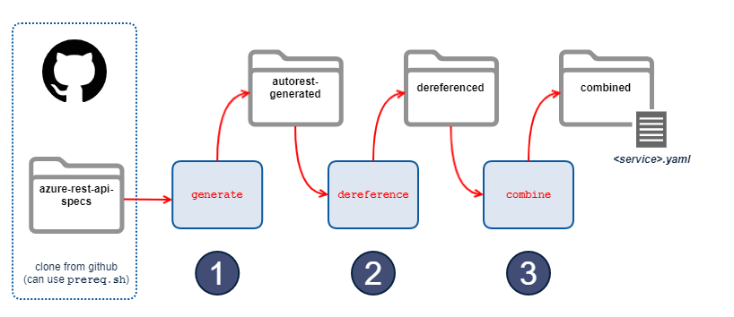

# Azure OpenAPI Doc Generator

Generates a single OpenAPI document for each Azure Resource Manager service from a set of OpenAPI specifications sourced from [__azure-rest-api-specs__](https://github.com/Azure/azure-rest-api-specs).  

This project uses [__autorest__](https://github.com/Azure/autorest) via JavaScript to emit the latest set of OpenAPI specifications for each service,  then dereferences and combines the documents into a single YAML OpenAPI specification using [__APIDevTools/json-schema-ref-parser__](https://github.com/APIDevTools/json-schema-ref-parser).  

## Usage

The main entrypoint to the program is:

```bash
bin/stackql-azure-openapi
```

This can be run without any arguments to get command line usage and help.  The `stackql-azure-openapi` commands include:

- `generate` : uses `autorest` to generate initial OpenAPI3 specs for one or many services
- `dereference` : dereferences all external JSON pointers in the generated OpenAPI specs
- `combine` : combines all the generated OpenAPI specs into a single OpenAPI spec

These commands are intended to be run in sequence with the output of each command being the input to the next.  The flow is summarized below:  

### IMAGE

[](images/stackql_azure_openapi.png)

Specific details about each command are provided in the sections below.  

## `generate` command

Uses `autorest` to generate initial OpenAPI3 specs for one or many services using the `autorest` configuration data in the `readme.md` in each service specification directory from the `main` branch of the [azure-rest-api-specs](https://github.com/Azure/azure-rest-api-specs) repo.  Conceptually this would be similar to running the following command in each subdirectory of the `specification` folder:      

```bash
autorest ./resource-manager/readme.md \
--openapi-type=arm \
--output-converted-oai3
```

The output of this command is a directory structure (n-levels deep) containing OpenAPI JSON documents with references to each other (using JSON `$refs`), the union of which forms a complete specification for the service.  

To generate specs for a single service (the `compute` service in this example), run the following command:

```bash
bin/stackql-azure-openapi generate compute
```

To generate specs for all services, run the following command:

```bash
bin/stackql-azure-openapi generate
```

## `dereference` command

Takes the output from the `generated` command, enumerates all JSON documents nested at any level in the directory structure, and dereferences all JSON pointers in each document, outputting a flat structure containing a document for each generated document found for each service with no external references.  

To dereference a set of `autorest` generated specs for a single service (the `compute` service in this example), run the following command:

```bash
bin/stackql-azure-openapi dereference compute
```

To dereference specs for all services, run the following command:

```bash
bin/stackql-azure-openapi dereference
```

## `combine` command

Takes the output from the `dereference` command, and combines all the generated documents into a single OpenAPI spec, outputting a single, self contained YAML document (removing the `examples` for brevity).  

To create a single OpenAPI document for a single service (the `compute` service in this example), run the following command:

```bash
bin/stackql-azure-openapi combine compute
```

To create a single OpenAPI document for all services, run the following command:

```bash
bin/stackql-azure-openapi combine
```